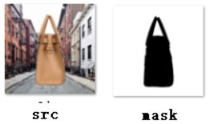

# FCN-pytorch-easiest

### Trying to be the easiest FCN pytorch implementation and just in a get and use fashion
Here I use a handbag semantic segmentation for illustration on how to train FCN on your own dataset and just go to use.
To train on your own dataset you just need to see in ```BagData.py``` which implements a train_dataloader in pytorch. What you actually need to do is providing the images file and the correspoding mask images. And for visualization in the training process I use ```visdom```.

### requirement

I have tested the code in ```pytorch 0.3.0.post4``` in anaconda ```python 3.6 ``` in ```ubuntu 14.04``` with ```GTX1080``` in ```cuda8.0``` 

### train

here three images pair is provided in folder ```last/``` and ```last_msk/``` . Here I want to do a handbag semantic segmentation which is stated as belows.



Firstly because ```visdom``` is used to visualize the training process, you need open another terminal and run 

```sh
python -m visdom.server
```

Then you run in another terminal

```bash
python FCN.py
```

You can open your browser and goto ```localhost:8097``` to see the visulization as following the first row is the prediction.


### deploy
and for deploy and inference I also provide a script ```inference.py```. You should be careful about the model path. Bacause I did not provide the trained weights file. :-P

BTW, ```FCN.py``` is copy from other repo.

```python
class FCN32s(nn.Module):
    def __init__(self, pretrained_net, n_class):
        super().__init__()
        self.n_class = n_class
        self.pretrained_net = pretrained_net
        self.relu = nn.ReLU(inplace=True)
        self.deconv1 = nn.ConvTranspose2d(512, 512, kernel_size=3, stride=2, padding=1, dilation=1, output_padding=1)
        self.bn1 = nn.BatchNorm2d(512)
        self.deconv2 = nn.ConvTranspose2d(512, 256, kernel_size=3, stride=2, padding=1, dilation=1, output_padding=1)
        self.bn2 = nn.BatchNorm2d(256)
        self.deconv3 = nn.ConvTranspose2d(256, 128, kernel_size=3, stride=2, padding=1, dilation=1, output_padding=1)
        self.bn3 = nn.BatchNorm2d(128)
        self.deconv4 = nn.ConvTranspose2d(128, 64, kernel_size=3, stride=2, padding=1, dilation=1, output_padding=1)
        self.bn4 = nn.BatchNorm2d(64)
        self.deconv5 = nn.ConvTranspose2d(64, 32, kernel_size=3, stride=2, padding=1, dilation=1, output_padding=1)
        self.bn5 = nn.BatchNorm2d(32)
        self.classifier = nn.Conv2d(32, n_class, kernel_size=1)

    def forward(self, x):
        output = self.pretrained_net(x)
        x5 = output['x5']  # size = (N, 512, x.H/32, x.W/32)

        score = self.bn1(self.relu(self.deconv1(x5)))  # size = (N, 512, x.H/16, x.W/16)
        score = self.bn2(self.relu(self.deconv2(score)))  # size = (N, 256, x.H/8, x.W/8)
        score = self.bn3(self.relu(self.deconv3(score)))  # size = (N, 128, x.H/4, x.W/4)
        score = self.bn4(self.relu(self.deconv4(score)))  # size = (N, 64, x.H/2, x.W/2)
        score = self.bn5(self.relu(self.deconv5(score)))  # size = (N, 32, x.H, x.W)
        score = self.classifier(score)  # size = (N, n_class, x.H/1, x.W/1)

        return score  # size = (N, n_class, x.H/1, x.W/1)


class FCN16s(nn.Module):

    def __init__(self, pretrained_net, n_class):
        super().__init__()
        self.n_class = n_class
        self.pretrained_net = pretrained_net
        self.relu = nn.ReLU(inplace=True)
        self.deconv1 = nn.ConvTranspose2d(512, 512, kernel_size=3, stride=2, padding=1, dilation=1, output_padding=1)
        self.bn1 = nn.BatchNorm2d(512)
        self.deconv2 = nn.ConvTranspose2d(512, 256, kernel_size=3, stride=2, padding=1, dilation=1, output_padding=1)
        self.bn2 = nn.BatchNorm2d(256)
        self.deconv3 = nn.ConvTranspose2d(256, 128, kernel_size=3, stride=2, padding=1, dilation=1, output_padding=1)
        self.bn3 = nn.BatchNorm2d(128)
        self.deconv4 = nn.ConvTranspose2d(128, 64, kernel_size=3, stride=2, padding=1, dilation=1, output_padding=1)
        self.bn4 = nn.BatchNorm2d(64)
        self.deconv5 = nn.ConvTranspose2d(64, 32, kernel_size=3, stride=2, padding=1, dilation=1, output_padding=1)
        self.bn5 = nn.BatchNorm2d(32)
        self.classifier = nn.Conv2d(32, n_class, kernel_size=1)

    def forward(self, x):
        output = self.pretrained_net(x)
        x5 = output['x5']  # size = (N, 512, x.H/32, x.W/32)
        x4 = output['x4']  # size = (N, 512, x.H/16, x.W/16)

        score = self.relu(self.deconv1(x5))  # size = (N, 512, x.H/16, x.W/16)
        score = self.bn1(score + x4)  # element-wise add, size = (N, 512, x.H/16, x.W/16)
        score = self.bn2(self.relu(self.deconv2(score)))  # size = (N, 256, x.H/8, x.W/8)
        score = self.bn3(self.relu(self.deconv3(score)))  # size = (N, 128, x.H/4, x.W/4)
        score = self.bn4(self.relu(self.deconv4(score)))  # size = (N, 64, x.H/2, x.W/2)
        score = self.bn5(self.relu(self.deconv5(score)))  # size = (N, 32, x.H, x.W)
        score = self.classifier(score)  # size = (N, n_class, x.H/1, x.W/1)

        return score  # size = (N, n_class, x.H/1, x.W/1)


class FCN8s(nn.Module):

    def __init__(self, pretrained_net, n_class):
        super().__init__()
        self.n_class = n_class
        self.pretrained_net = pretrained_net
        self.relu = nn.ReLU(inplace=True)
        self.deconv1 = nn.ConvTranspose2d(512, 512, kernel_size=3, stride=2, padding=1, dilation=1, output_padding=1)
        self.bn1 = nn.BatchNorm2d(512)
        self.deconv2 = nn.ConvTranspose2d(512, 256, kernel_size=3, stride=2, padding=1, dilation=1, output_padding=1)
        self.bn2 = nn.BatchNorm2d(256)
        self.deconv3 = nn.ConvTranspose2d(256, 128, kernel_size=3, stride=2, padding=1, dilation=1, output_padding=1)
        self.bn3 = nn.BatchNorm2d(128)
        self.deconv4 = nn.ConvTranspose2d(128, 64, kernel_size=3, stride=2, padding=1, dilation=1, output_padding=1)
        self.bn4 = nn.BatchNorm2d(64)
        self.deconv5 = nn.ConvTranspose2d(64, 32, kernel_size=3, stride=2, padding=1, dilation=1, output_padding=1)
        self.bn5 = nn.BatchNorm2d(32)
        self.classifier = nn.Conv2d(32, n_class, kernel_size=1)

    def forward(self, x):
        output = self.pretrained_net(x)
        x5 = output['x5']  # size = (N, 512, x.H/32, x.W/32)
        x4 = output['x4']  # size = (N, 512, x.H/16, x.W/16)
        x3 = output['x3']  # size = (N, 256, x.H/8,  x.W/8)

        score = self.relu(self.deconv1(x5))  # size = (N, 512, x.H/16, x.W/16)
        score = self.bn1(score + x4)  # element-wise add, size = (N, 512, x.H/16, x.W/16)
        score = self.relu(self.deconv2(score))  # size = (N, 256, x.H/8, x.W/8)
        score = self.bn2(score + x3)  # element-wise add, size = (N, 256, x.H/8, x.W/8)
        score = self.bn3(self.relu(self.deconv3(score)))  # size = (N, 128, x.H/4, x.W/4)
        score = self.bn4(self.relu(self.deconv4(score)))  # size = (N, 64, x.H/2, x.W/2)
        score = self.bn5(self.relu(self.deconv5(score)))  # size = (N, 32, x.H, x.W)
        score = self.classifier(score)  # size = (N, n_class, x.H/1, x.W/1)

        return score  # size = (N, n_class, x.H/1, x.W/1)
```

